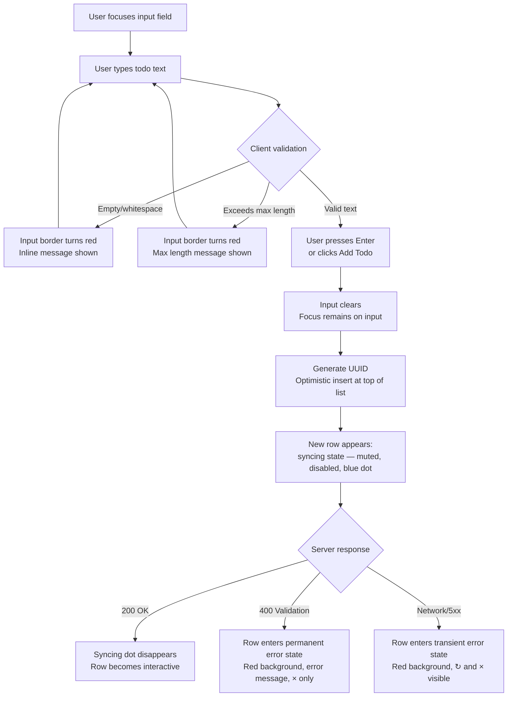
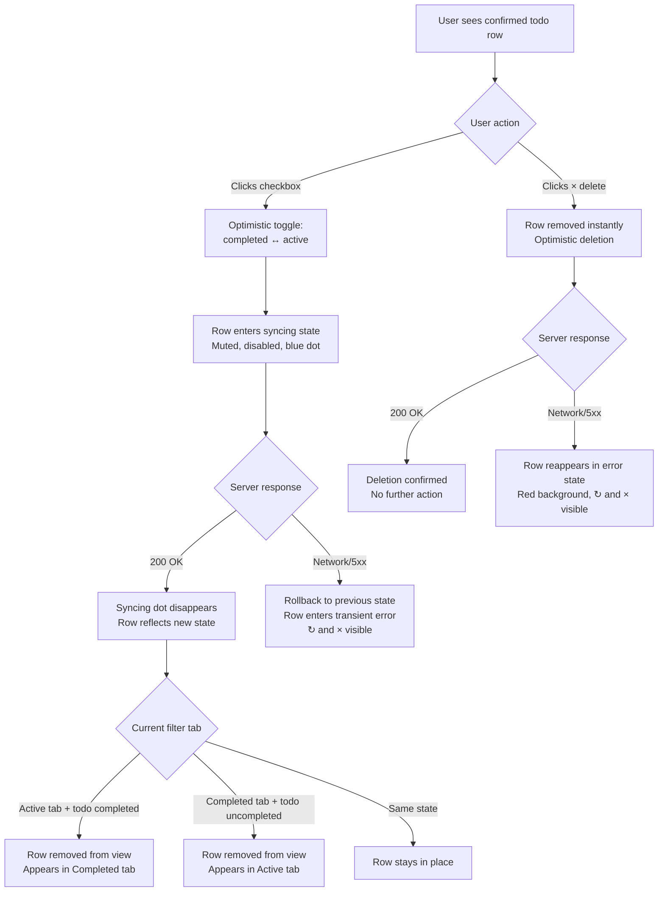
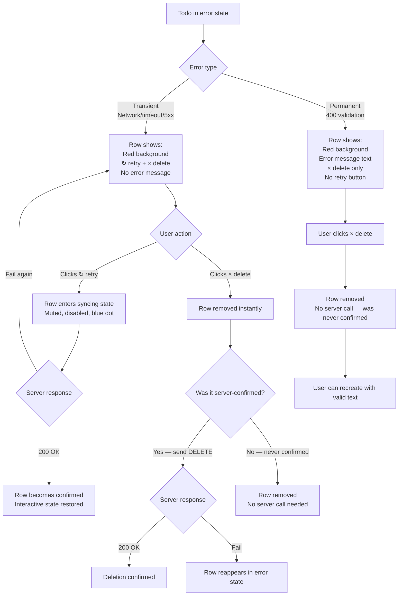
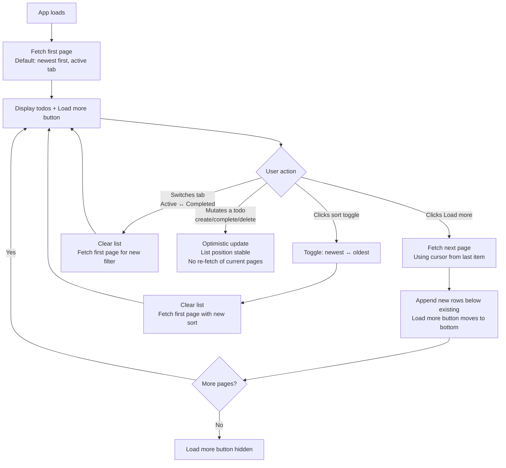

# UX Design Specification todo-app

**Author:** dvd
**Date:** 2026-02-27

---

<!-- UX design content will be appended sequentially through collaborative workflow steps -->

## Executive Summary

### Project Vision

A production-grade full-stack todo application that applies rigorous engineering patterns — optimistic UI, per-todo state machines, cursor-based pagination, idempotent writes — to the simplest possible domain. The product targets a single user managing personal tasks across desktop and mobile browsers, with all interactions feeling instantaneous via optimistic updates backed by a durable REST API and Postgres persistence. No authentication, collaboration, or advanced task features in v1 — the scope is deliberately minimal to deliver a polished, complete-feeling product. The project doubles as a professional development simulation, with value in both the engineering process and the final deliverable.

### Target Users

- **Alex (Primary):** Needs a frictionless place to track personal tasks without signing up, configuring anything, or learning a new tool. Uses the app across desktop and mobile browsers, sometimes on unreliable connections. Expects instant feedback, zero onboarding, and data that persists across sessions.
- **Sam (Secondary):** A developer joining the project to evaluate code quality, onboardability, and release readiness. Expects clean package boundaries, reproducible setup, and a complete artifact trail from requirements to implementation.

### Key Design Challenges

1. **State communication without clutter:** Three visual states (interactive, syncing, error) with two error sub-types (transient vs permanent) must be instantly distinguishable through subtle cues — status dots, color accents, disabled states — without overwhelming a minimal interface.
2. **Optimistic UI trust contract:** The UI reflects intended state before server confirmation. Error recovery flows (retry/delete) must feel like natural interaction paths, not system failures, to maintain user trust in the "instant" feel.
3. **Dense mobile interactions:** Checkbox, status indicators, action buttons, and error messages must coexist in a single todo row on 320px viewports while maintaining 44x44px touch targets.

### Design Opportunities

1. **Zero-onboarding as differentiator:** Input-as-first-row pattern makes the app self-teaching. No auth wall, no tutorial overlay, no empty-state illustration — the interface communicates affordances through standard conventions alone.
2. **Error transparency as trust builder:** Contextual recovery actions (retry for network failures, delete-only for validation errors) make the app feel more reliable than competitors that silently swallow errors.
3. **Invisible pagination:** Cursor-based pagination with stable positioning across mutations ensures the user never loses their place — a "just works" feel at scale that most simple todo apps fail to deliver.

## Core User Experience

### Defining Experience

The core experience is the **create-then-see-it-instantly loop**: type a task, press Enter, see it appear at the top of the list — indistinguishable from a local-only operation. This single interaction establishes the user's mental model for the entire app. Every subsequent action (complete, delete, retry) inherits the trust built in that first instant insertion. The app feels like directly manipulating objects, not submitting requests to a remote server.

The most frequent action is creating todos. The most critical action is the same — if creation feels laggy or uncertain, nothing else matters. The input field is always visible and always ready, reinforcing that this is the app's primary affordance.

### Platform Strategy

- **Platform:** Web SPA (single-page application), no native apps in v1
- **Responsive tiers:** Desktop (≥768px) and mobile (<768px) — two-tier layout, mobile-first approach
- **Input modes:** Touch (mobile) and mouse/keyboard (desktop) — both fully supported
- **Offline:** Not supported in v1. App requires network connectivity; failures are handled through the per-todo error state model, not through offline queuing
- **Device capabilities:** No native APIs leveraged. Standard web platform only (HTML, CSS, JS)

### Effortless Interactions

Every core action is a single gesture with no intermediate confirmation or configuration:

| Action | Interaction | Notes |
|---|---|---|
| Create todo | Type text → Enter (or click "Add Todo") | Dual creation paths for different preferences |
| Complete todo | Single tap/click on checkbox | Immediate visual transition |
| Uncomplete todo | Single tap/click on completed checkbox | Same gesture reverses the action |
| Delete todo | Single tap/click on delete action | No confirmation dialog — immediate removal |
| Filter view | Tap/click Active or Completed tab | Instant tab switch, independent pagination |
| Toggle sort | Tap/click sort toggle | Flip between newest-first and oldest-first |
| Retry failed todo | Tap/click retry action | Available only on transient errors |
| Load more | Scroll or tap "Load more" | Seamless cursor-based pagination |

### Critical Success Moments

1. **First todo created:** The instant it appears with zero friction, the user's mental model locks in — "this app does what I tell it, right now."
2. **First error recovered:** Hitting retry and watching it succeed confirms the app handles failure gracefully. Trust deepens.
3. **Return visit:** Opening the app and seeing everything exactly as left confirms session durability. The user stops thinking about whether their data is safe.
4. **Make-or-break invariant:** If a todo ever enters an ambiguous state — not syncing, not errored, not confirmed — the entire trust contract collapses. Every todo must always be in exactly one of the three visual states.

### Experience Principles

1. **Instant is the baseline.** Every user action produces immediate visual feedback. The server is a background concern, never a foreground bottleneck.
2. **Every state is visible.** No ambiguity — the user can always tell what's happening with every todo: confirmed, syncing, or errored. No limbo states.
3. **Errors are actions, not dead ends.** When something fails, the UI provides exactly the recovery paths that make sense for that failure type. The user is never stuck.
4. **The interface teaches itself.** No onboarding, no help text, no tutorials. Standard UI conventions communicate all affordances. If you have to explain it, it's wrong.

## Desired Emotional Response

### Primary Emotional Goals

**Confident control** — the user feels in charge of their list at all times. Not empowerment in a grandiose sense, but the quiet confidence of a tool that does exactly what you expect, every time. The closest analogy: the feeling of using a physical notepad. You write something, it's there. You cross it off, it's done. No surprises.

### Emotional Journey Mapping

| Stage | Target Feeling | What Drives It |
|---|---|---|
| First discovery | Clarity — "I already know how to use this" | No auth wall, no tutorial, input field ready |
| First creation | Satisfaction — "That was instant" | Optimistic insert, no spinner |
| Building a list | Momentum — "I'm getting organized" | Smooth sequential creates, list grows visibly |
| Completing a todo | Accomplishment — "Progress, visible" | Immediate visual state change, tab filtering |
| Error occurs | Calm alertness — "Something happened, I can fix it" | Clear visual indicator + actionable recovery |
| Successful retry | Relief + trust — "It handled that gracefully" | Retry works, todo settles into confirmed state |
| Return visit | Assurance — "Everything's still here" | Full persistence, exact state preserved |

### Micro-Emotions

- **Confidence over confusion:** Every element's purpose is obvious. Every state is unambiguous. This is the most important emotional axis.
- **Trust over skepticism:** Optimistic UI creates a promise. Consistent instant feedback, reliable persistence, and transparent errors compound trust. One ambiguous state breaks it.
- **Accomplishment over frustration:** Completing todos feels like progress, not bureaucracy. The visual transition from active to completed carries emotional weight.

**Emotions to Avoid:**
- **Anxiety** — "Did it save?" should never cross the user's mind. The syncing dot prevents this.
- **Helplessness** — an error with no recovery path. Transient/permanent distinction ensures every error has an action.
- **Distrust** — data disappearing, state inconsistencies, or optimistic updates that silently fail.

### Design Implications

| Emotion | Design Approach |
|---|---|
| Confident control | Instant optimistic feedback, visible state for every todo, no confirmation dialogs |
| Calm alertness on error | Red accent is noticeable but not alarming; recovery actions are prominent and clear |
| Trust in persistence | Syncing dot provides real-time confirmation; return visits show exact prior state |
| Momentum during use | Input stays focused after create, list updates without page jumps, pagination is seamless |
| Accomplishment on completion | Distinct visual treatment for completed items, completed tab shows accumulation |

### Emotional Design Principles

1. **Predictability breeds confidence.** Every interaction behaves the same way every time. No modal variance, no conditional behaviors, no surprises.
2. **Transparency builds trust.** The syncing dot, error accents, and recovery actions make the system's state legible. The user never wonders what happened.
3. **Progress should feel tangible.** Visual transitions between states — active to completed, error to recovered — carry emotional weight. These aren't just UI updates, they're moments of accomplishment or relief.
4. **Errors should feel manageable, not alarming.** Red accents signal attention without panic. Recovery actions are clear and immediately available. The emotional register is "heads up" not "something broke."

## UX Pattern Analysis & Inspiration

### Inspiring Products Analysis

**Todoist — Purpose-built task management**
- Input-then-instant-appear loop is the gold standard for task creation UX
- Checkbox completion has satisfying visual weight — brief animation, item transitions to completed state
- Keyboard-first without sacrificing touch usability
- Clear visual hierarchy between active and completed items
- Error handling is mostly invisible — sync feels like "it just works"

**Google Keep — Zero-friction capture**
- Zero mental overhead to create — tap, type, done
- Sync feedback is subtle and non-distracting; optimistic local state with background persistence
- Empty state invites creation without being annoying or patronizing
- The app feels like a scratchpad, not a database

**Notion (lists) — Flexible structure with tangible feel**
- Checkbox lists feel tangible — checking an item carries visual weight
- Clean row density with strong visual distinction between done/not-done
- Smooth keyboard navigation within lists
- Structured data that feels like plain text editing, not tool operation

### Transferable UX Patterns

| Pattern | Source | Application to todo-app |
|---|---|---|
| Always-ready text input | Google Keep, Todoist | Input-as-first-row, no "click to add" intermediary |
| Instant list insertion | Todoist | Optimistic insert with smooth list adjustment |
| Satisfying checkbox completion | Todoist, Notion | Visual state change that carries emotional weight |
| Active/completed visual hierarchy | All three | Active items prominent, completed items visually demoted |
| Background sync without attention | Google Keep, Todoist | Syncing dot is subtle; success is silent, only errors demand attention |
| Clean row density | Notion | Scannable rows with clear affordances, no visual noise |
| Keyboard-first interaction | Todoist, Notion | Tab order, Enter to create, keyboard-navigable actions |

### Anti-Patterns to Avoid

- **Feature density creep (Todoist):** Labels, priorities, projects, filters, natural language dates — resist every feature beyond CRUD + state management. Scope discipline is a UX decision.
- **Card/grid layout (Google Keep):** Works for notes, wrong for a linear task list. Scannable rows, not a card grid.
- **Loading jank (Notion):** First-load can feel slow. Placeholder rows must prevent any perception of loading delay.
- **Confirmation dialogs on delete:** None of these apps handle this well. Immediate deletion is the right call — it matches the "instant is the baseline" principle.
- **Silent error swallowing:** All three apps lean toward hiding sync issues. Our per-todo state machine is deliberately more transparent — errors are visible and actionable.

### Design Inspiration Strategy

| Source | Adopt | Adapt | Avoid |
|---|---|---|---|
| Todoist | Input-then-appear loop, completion animation feel | Simplify — no projects/labels/priority, single list with tabs | Feature density, settings complexity |
| Google Keep | Zero-friction creation, calm sync behavior | Apply to list format instead of cards | Card/grid layout, color categories |
| Notion | Checkbox prominence, clean row density, keyboard nav | Simplify — no block types, no slash commands | Loading jank, block-editor complexity |

**Synthesis:** The todo-app borrows Todoist's task creation rhythm, Google Keep's "scratchpad not database" ethos, and Notion's tangible checkbox interaction — while being more transparent about sync state than any of them. The key differentiator is error visibility: where these apps hide failures, todo-app makes them first-class UI citizens with clear recovery paths.

## Design System Foundation

### Design System Choice

**shadcn (framework-variant TBD) + Tailwind CSS**

- **If React:** `shadcn/ui` (Radix UI primitives)
- **If Svelte:** `shadcn-svelte` (Bits UI primitives)

shadcn components are copied into the project as owned source code — not installed as a dependency. Only the components needed are added. Tailwind CSS provides the utility-first styling layer underneath. The framework decision (Svelte vs React) is deferred to architecture phase; the design system choice is the same either way.

### Rationale for Selection

1. **Accessible primitives without effort:** Radix (React) or Bits UI (Svelte) handle keyboard navigation, ARIA attributes, and focus management for interactive components. Writing accessible tab panels and checkboxes from scratch is error-prone and not where a solo developer should spend time.
2. **Framework-agnostic decision:** Both shadcn variants share the same API surface, styling approach, and Tailwind theming model. The design system doesn't constrain the framework choice.
3. **Zero bundle overhead:** Components are source code in the project, not a library import. Tree-shaking is natural — unused code doesn't exist.
4. **Full visual control:** Tailwind utility classes + CSS variable tokens mean complete customization without fighting a component library's opinions.
5. **Right-sized for the component surface:** The app needs ~5-6 primitives (Input, Checkbox, Button, Tabs, Badge). shadcn lets us import exactly those without pulling in 100+ unused components.

### Implementation Approach

**Components to import from shadcn:**

| Component | Usage | Accessibility benefit |
|---|---|---|
| `Input` | Todo creation text field | Focus/disabled/error states, ARIA labels |
| `Checkbox` | Todo completion toggle | Keyboard operable, ARIA checked state |
| `Button` | "Add Todo", delete, retry actions | Variant support (ghost, destructive), focus ring |
| `Tabs` | Active/Completed filter | Full accessible tab panel pattern (roles, arrow keys) |
| `Badge` or custom | Syncing/error status indicators | `role="status"`, `aria-live` |

**Custom components (built on Tailwind, not from shadcn):**
- Todo row (composition of shadcn primitives + layout)
- Todo list (container with pagination logic)
- Status dot (syncing indicator — too specific for a generic primitive)
- Error message inline (per-todo error display)
- Placeholder rows (empty state / skeleton)

### Customization Strategy

- **Theming:** Single CSS variable token file controls colors, spacing, radii, and shadows across all shadcn components. Define a minimal, neutral palette that supports the 3-visual-state model (interactive, syncing, error).
- **Variants:** Leverage shadcn's built-in variant system for Button (default, ghost, destructive) and Badge (default, syncing, error) rather than creating parallel styling.
- **Responsive:** Tailwind responsive prefixes (`sm:`, `md:`) handle the two-tier layout. No custom breakpoint system needed.
- **Dark mode:** Not in v1 scope, but Tailwind + shadcn CSS variables make it trivially addable later.

## Defining Experience

### The Core Interaction

**"Type it, it's there."**

The defining experience is the create-then-see-it loop reduced to its absolute minimum: type a task, press Enter, it exists in your list. No sign-up, no configuration, no loading state on the happy path. The simplicity *is* the feature. Users would describe this app in one sentence, and that sentence is the entire product pitch.

### User Mental Model

Users bring a **physical notepad** mental model:
- Write something down → it's written
- Cross it off → it's done
- Tear it out → it's gone

The app must match that directness exactly. Actions happen at the speed of thought — no "processing," no "submitting."

**Confusion risk:** The syncing dot and error states are the only moments where the app reveals it's not a notepad. These break the illusion briefly, but the recovery path (retry or delete) restores it. The key is that these moments feel like *handling a situation*, not like *discovering the app is broken*.

**What existing solutions get wrong:** Most todo apps demand setup before use (accounts, projects, categories). Others feel sluggish because they wait for server confirmation before updating the UI. This app does neither.

### Success Criteria

1. Time between pressing Enter and seeing the todo in the list is imperceptible (<50ms)
2. Input field is ready for the next todo immediately after submission — no focus loss, no clearing delay
3. A user creating 5 todos in rapid succession never sees a spinner, delay, or layout shift
4. If all 5 succeed, the syncing dots disappear silently — the user may not even notice them
5. If one fails, exactly that one shows the error — the other 4 are unaffected

### Novel UX Patterns

**Pattern classification: Established with one novel twist.**

All core interactions use universal conventions:
- Text input → Enter to submit
- Checkbox to complete/uncomplete
- Tab-based filtering (Active/Completed)
- Delete button for removal

**The novel element:** Per-todo state machine exposed through visual states. Most apps either hide sync state entirely or show a global "syncing" indicator. Showing per-item sync/error state with contextual recovery actions is unusual. It requires no user education — the visual cues (status dot, red accent, action buttons) are self-evident — but it's a pattern most users haven't encountered before. The innovation is in transparency, not in interaction.

### Experience Mechanics

**The create flow — step by step:**

| Phase | What Happens | User Sees | System Does |
|---|---|---|---|
| **Initiation** | User focuses input field (always visible at top) | Cursor in input, placeholder text fades | Nothing yet |
| **Input** | User types todo text | Characters appear, validation runs inline | Client-side validation (max length) |
| **Submission** | User presses Enter or clicks "Add Todo" | Input clears, new todo appears instantly at top with syncing dot | Generate UUID, optimistic insert, fire API request |
| **Syncing** | Network request in flight | Syncing dot visible, row slightly muted, interactions disabled | POST/PUT to server |
| **Success** | Server confirms | Syncing dot disappears, row becomes fully interactive | Cache update via TanStack Query |
| **Failure (transient)** | Network error | Red accent, retry + delete actions appear | Optimistic state preserved, error state set |
| **Failure (permanent)** | Validation error from server | Red accent, error message, delete action only | Optimistic state preserved, error state set |
| **Recovery** | User retries or deletes | Retry → back to syncing; Delete → row removed | Same UUID on retry (idempotent) |

## Visual Design Foundation

### Color System

**Palette philosophy:** Neutral-first with semantic accents. Color only enters the interface to communicate *state* (syncing blue, error red). The default experience is calm and unsaturated — semantic colors carry maximum signal.

| Role | Token | Value | Usage |
|---|---|---|---|
| Background | `--background` | #FFFFFF | Page background |
| Surface | `--card` | #FAFAFA | Todo rows, input area |
| Text primary | `--foreground` | #0A0A0A | Todo text, headings |
| Text secondary | `--muted-foreground` | #737373 | Placeholder text, completed todos, secondary info |
| Border | `--border` | #E5E5E5 | Row separators, input border |
| Primary | `--primary` | #171717 | "Add Todo" button, active tab indicator |
| Syncing | `--syncing` | #3B82F6 | Status dot during sync |
| Success | `--success` | #22C55E | Brief confirmation (optional) |
| Error | `--destructive` | #DC2626 | Error accent, destructive actions |
| Error background | `--destructive/10` | #FEF2F2 | Error row background tint |

### Typography System

**Primary font:** Roboto (Google Fonts) with system font fallback

```
font-family: 'Roboto', -apple-system, BlinkMacSystemFont, "Segoe UI", sans-serif;
```

**Tone:** Clean, modern, neutral — typography should be invisible, not decorative.

| Element | Size | Weight | Line Height | Notes |
|---|---|---|---|---|
| App title | 1.5rem (24px) | 600 (semibold) | 1.2 | |
| Todo text | 1rem (16px) | 400 (regular) | 1.5 | |
| Completed todo | 1rem (16px) | 400 + strikethrough | 1.5 | Color demoted to `--muted-foreground` |
| Input placeholder | 1rem (16px) | 400 | 1.5 | Color: `--muted-foreground` |
| Tab labels | 0.875rem (14px) | 500 (medium) | 1.4 | |
| Error message | 0.8125rem (13px) | 400 | 1.4 | Color: `--destructive` |
| Button text | 0.875rem (14px) | 500 (medium) | 1 | |

**Font loading:** Load Roboto 400 and 500 weights from Google Fonts. Use `font-display: swap` to prevent FOIT (flash of invisible text) — system font renders immediately, Roboto swaps in when loaded.

### Spacing & Layout Foundation

**Base unit:** 4px — all spacing is multiples of 4.
**Feel:** Clean and airy. Enough breathing room that each todo row feels like a distinct object.
**Content max-width:** 640px centered — keeps reading width comfortable on wide screens.

| Element | Spacing |
|---|---|
| Page padding (desktop) | 24px (6 units) |
| Page padding (mobile) | 16px (4 units) |
| Todo row height | 48px minimum (12 units) |
| Todo row vertical padding | 12px (3 units) |
| Todo row horizontal padding | 16px (4 units) |
| Gap between rows | 1px border (visual separator) |
| Input area bottom margin | 16px (4 units) |
| Tab bar bottom margin | 12px (3 units) |
| Error message top padding | 4px (1 unit) |

**Layout structure (top to bottom):**
1. App title
2. Input area (text field + "Add Todo" button)
3. Tab bar (Active / Completed)
4. Todo list (scrollable, paginated)
5. "Load more" trigger (bottom of list)

### Accessibility Considerations

- **Contrast ratios (WCAG AA):**
  - Primary text (#0A0A0A) on white: 19.4:1 — passes AAA
  - Completed/secondary text (#737373) on white: 4.56:1 — passes AA
  - Error text (#DC2626) on white: 5.58:1 — passes AA
  - Error text on error background (#FEF2F2): 5.14:1 — passes AA
- **Focus indicators:** 2px solid `--primary` with 2px offset on all interactive elements
- **Touch targets:** 44x44px minimum enforced through row height (48px) and button sizing
- **Font sizing:** Base 16px ensures readability; no text smaller than 13px
- **Motion:** No required animations — transitions are enhancement only, respects `prefers-reduced-motion`

## Design Direction Decision

### Design Directions Explored

Six visual directions were generated and evaluated in `_bmad-output/planning-artifacts/ux-design-directions.html`:

| Direction | Character | Key Traits |
|---|---|---|
| A: Clean Minimal | Understated, content-focused | Flat list, thin borders, hover-reveal icon actions |
| B: Card Elevated | Tangible, object-oriented | Individual cards with shadows, pill tabs |
| C: Bordered Structured | App-like, organized | Strong borders, header bar with sort, full-width tabs |
| D: Ultra Minimal | Designer's tool | Max whitespace, underline input, outline-only checkboxes |
| E: Compact Dense | Power user, efficient | Toolbar header, tight spacing, max density |
| F: Soft Rounded | Friendly, approachable | Generous radii, warm stone tones, thick borders |

### Chosen Direction

**C + A hybrid: Bordered Structured with lightweight actions**

Base layout and structure from Direction C, with action button treatment and pagination from Direction A.

**From Direction C (base):**
- Header bar with app title and sort toggle button
- Bordered input area with background tint on focus
- Full-width equal tabs (Active / Completed) with bottom border indicator
- Strong row borders with consistent structure
- Timestamp metadata per row

**From Direction A (actions + pagination):**
- Icon-only action buttons (`×` for delete, `↻` for retry) instead of labeled buttons
- Hover-reveal for delete on normal rows; always-visible on error rows
- "Load more" button at bottom of list for cursor pagination

### Design Rationale

1. **C's structure supports the "app-like" feel** — strong borders and a header bar communicate that this is a real tool, not a toy. The sort toggle has a natural home in the header.
2. **A's icon actions reduce visual noise** — labeled "Retry" and "Delete" buttons are heavy for a minimal todo app. Icon-only actions (`↻`, `×`) are universally understood and keep the row clean at rest.
3. **Hover-reveal on normal rows, always-visible on error rows** — error states need immediate, obvious recovery paths. Normal rows benefit from a cleaner resting state.
4. **"Load more" button over infinite scroll** — explicit pagination control is more predictable than scroll-triggered loading. Matches the "confident control" emotional goal.
5. **Timestamps add context without clutter** — small, secondary-colored timestamps help users orient within their list without competing with todo text.

### Implementation Approach

**Layout structure:**

```
┌──────────────────────────────────────┐
│  todos                    ↕ Newest   │  ← Header bar (bordered)
├──────────────────────────────────────┤
│  [What needs to be done?]    [Add]   │  ← Input area (bordered)
├───────────────┬──────────────────────┤
│    Active     │     Completed        │  ← Full-width tabs (bordered)
├───────────────┴──────────────────────┤
│  ☐  Deploy to production    ● just…  │  ← Syncing row (muted, disabled)
├──────────────────────────────────────┤
│  ☐  Write unit tests         2m  ×   │  ← Normal row (× on hover)
├──────────────────────────────────────┤
│  ☐  Fix pagination bug    ↻  ×      │  ← Error row (red bg, actions visible)
├──────────────────────────────────────┤
│  ☐  Set up Docker stack     1h   ×   │  ← Normal row
├──────────────────────────────────────┤
│           [ Load more ]              │  ← Pagination trigger
└──────────────────────────────────────┘
```

**Key implementation details:**
- Outer border: 1px solid `--border` with 12px border-radius (frame container)
- Row borders: 1px solid `--border` between all rows
- Header: `--card` background (#FAFAFA), title left-aligned, sort button right-aligned
- Input area: `--card` background on input, transitions to white + `--primary` border on focus
- Tabs: Equal width, `--primary` bottom border on active tab, `--card` background on active
- Actions: Icon buttons, `--muted-foreground` color, hover to `--destructive` for delete
- Error rows: `--destructive/10` background, no left border accent (full row tint instead)
- Syncing rows: 50% opacity, pointer-events disabled
- Timestamps: `--muted-foreground`, 12px font size, right-aligned
- Load more: Centered text button with `--border` border, full width of container

## User Journey Flows

### Flow 1: Todo Creation (Happy Path)

**Entry:** User focuses input field (always visible in input area)
**Goal:** Create a new todo and see it appear instantly in the list



**Key UX details:**
- Input clears and retains focus immediately on submit — ready for the next todo
- New todo always inserts at top of list (newest-first default sort)
- If list exceeds page size, overflow items are hidden (not shifted)
- Syncing dot pulses subtly — noticeable but not distracting
- On success, the transition from syncing to interactive is silent — no toast, no flash

### Flow 2: Todo Completion & Deletion

**Entry:** User interacts with an existing, confirmed todo row
**Goal:** Mark a todo complete/incomplete, or delete it



**Key UX details:**
- Completion toggle is optimistic — checkbox state flips immediately
- Completed todos move to Completed tab only when filter is active; if viewing "All" (future), they stay in place with visual demotion
- Delete is immediate, no confirmation — matches "instant is the baseline" principle
- Failed deletion causes the row to reappear in error state — user is never confused about whether it was actually deleted
- Cursor pagination remains stable after deletion — no page re-fetch or position jump

### Flow 3: Error Recovery (Transient & Permanent)

**Entry:** A todo is in error state (red background, action buttons visible)
**Goal:** Resolve the error by retrying or deleting



**Key UX details:**
- Transient errors show `↻` + `×` — two recovery paths
- Permanent errors show error message + `×` only — retry would fail again with the same data
- Retry uses the same UUID — server upserts, preventing duplicates
- Deleting a never-confirmed todo requires no server call — it only existed optimistically
- Error rows are always fully visible (no hover-reveal) — recovery must be obvious
- Checkbox is non-interactive on error rows — can't complete a todo that isn't confirmed

### Flow 4: Pagination & Sort

**Entry:** User has more todos than one page can display
**Goal:** Browse the full list and change sort order



**Key UX details:**
- Cursor-based pagination ensures stable positioning — deleting item 5 doesn't cause item 21 to jump into view
- Sort toggle resets to first page — necessary because the cursor is invalidated by sort change
- Tab switch resets to first page — Active and Completed have independent pagination
- Optimistic mutations don't trigger page re-fetches — the list updates in place
- "Load more" is a button, not infinite scroll — explicit control matches "confident control" principle
- Page size is a shared constant from the `shared` package

### Journey Patterns

**Consistent patterns across all flows:**

| Pattern | Application | Rationale |
|---|---|---|
| Optimistic-first | All mutations show intended state before server confirms | "Instant is the baseline" principle |
| Per-item state | Each todo independently tracks syncing/confirmed/error | One failure doesn't affect the rest of the list |
| Silent success | Successful syncs remove the dot without any announcement | Success should be the unremarkable default |
| Loud failure | Errors get red background + visible action buttons | "Every state is visible" principle |
| Same-gesture retry | Retry uses `↻`, same UUID, same operation | Idempotent — safe to retry without consequences |
| Graceful rollback | Failed completions revert to previous state + error | User sees the truth, not a stuck optimistic lie |

### Flow Optimization Principles

1. **Minimum steps to value:** Create = 2 actions (type + Enter). Complete = 1 action (click checkbox). Delete = 1 action (click ×). No flow requires more than 2 user actions to reach its goal.
2. **Error recovery is never more than 1 action:** Retry = click `↻`. Delete errored = click `×`. The user is never more than one click from resolving any error state.
3. **No modal interruptions:** Zero confirmation dialogs, zero toast notifications, zero popups across all flows. State is communicated inline, within the row itself.
4. **Filter/sort resets are instant:** Tab switches and sort toggles clear and re-fetch — perceived as instant because the fetch is fast and the UI responds immediately to the user's click.

## Component Strategy

### Design System Components (from shadcn)

| Component | Import | Usage | Customization |
|---|---|---|---|
| `Input` | shadcn primitive | Todo creation text field | Error border variant via `--destructive`, disabled state for syncing |
| `Checkbox` | shadcn primitive | Todo completion toggle | Square with rounded corners (matches Direction C), disabled during sync |
| `Button` | shadcn primitive | Add, delete, retry, sort, load more | Variants: `default` (Add Todo, sort), `ghost` (delete ×, retry ↻), `destructive` (delete on error hover) |
| `Tabs` | shadcn primitive | Active/Completed filter | Full-width equal tabs, `--primary` bottom border on active |

### Custom Components

#### TodoRow

**Purpose:** The core display unit — renders a single todo with all its states and actions.

**Anatomy:**
```
┌─────────────────────────────────────────────────────┐
│  [☐]  Todo text content here          2m ago  [×]   │
│                                                     │
│  (error state only:) Error message text              │
└─────────────────────────────────────────────────────┘
```

**Props:**
- `todo` — todo data object (id, text, completed, createdAt, updatedAt)
- `state` — `confirmed` | `syncing` | `transient-error` | `permanent-error`
- `errorMessage` — string (only for permanent errors)
- `onToggle` — checkbox click handler
- `onDelete` — delete click handler
- `onRetry` — retry click handler (transient errors only)

**States:**

| State | Background | Checkbox | Text | Status Dot | Actions | Interaction |
|---|---|---|---|---|---|---|
| Confirmed (active) | white | unchecked | `--foreground` | none | × on hover | fully interactive |
| Confirmed (completed) | white | checked | `--muted-foreground` + strikethrough | none | × on hover | fully interactive |
| Syncing | white | frozen | muted (50% opacity) | blue, pulsing | none | disabled (pointer-events: none) |
| Transient error | `--destructive/10` | frozen | `--foreground` | red, static | ↻ + × (always visible) | only ↻ and × clickable |
| Permanent error | `--destructive/10` | frozen | `--foreground` | red, static | × only (always visible) | only × clickable |

**Accessibility:**
- `role="listitem"` on the row
- `aria-disabled="true"` during syncing
- `aria-label` on icon-only buttons: "Delete todo", "Retry todo"
- Error message linked via `aria-describedby` to the row
- Keyboard: Tab to checkbox → Tab to delete/retry → Enter/Space to activate

#### TodoList

**Purpose:** Container managing the ordered list of TodoRows, pagination, and empty state.

**Anatomy:**
```
┌─────────────────────────────────────────────────────┐
│  [TodoRow]                                          │
│  [TodoRow]                                          │
│  [TodoRow]                                          │
│  ...                                                │
├─────────────────────────────────────────────────────┤
│              [ Load more ]                          │  ← only when hasNextPage
└─────────────────────────────────────────────────────┘

OR (empty state):

┌─────────────────────────────────────────────────────┐
│  [PlaceholderRow]                                   │
│  [PlaceholderRow]                                   │
│  [PlaceholderRow]                                   │
└─────────────────────────────────────────────────────┘
```

**Props:**
- `todos` — array of todo objects with their states
- `hasNextPage` — boolean
- `onLoadMore` — load more click handler
- `isLoadingMore` — boolean (disable button during fetch)

**Behavior:**
- Renders TodoRows in order (sorted by createdAt per current sort direction)
- Shows "Load more" button when `hasNextPage` is true
- Shows PlaceholderRows when list is empty and not loading
- Shows loading skeleton when initial fetch is in progress
- Optimistic inserts appear at top; list doesn't re-fetch existing pages

**Accessibility:**
- `role="list"` on the container
- `aria-live="polite"` region wrapping the list for announcing new items
- "Load more" button: `aria-label="Load more todos"`

#### StatusDot

**Purpose:** Small indicator showing per-todo sync state.

**Anatomy:** 8×8px circle, positioned after todo text.

**Variants:**

| Variant | Color | Animation | Usage |
|---|---|---|---|
| `syncing` | `--syncing` (#3B82F6) | Pulse (opacity 1 → 0.4 → 1, 1.5s) | Request in flight |
| `error` | `--destructive` (#DC2626) | None (static) | Request failed |
| `hidden` | n/a | n/a | Confirmed state — dot not rendered |

**Accessibility:**
- `role="status"` with `aria-label`: "Syncing" or "Error"
- `aria-live="polite"` so screen readers announce state changes

#### ErrorMessage

**Purpose:** Inline error text displayed below todo text in permanent error state.

**Anatomy:** Single line of text below the todo text within the row.

**Styling:**
- Font: 13px, `--destructive` color
- Top padding: 4px
- Only rendered when `state === 'permanent-error'`

**Content:** Server-provided error message (e.g., "Text exceeds maximum length")

**Accessibility:**
- `id` linked to TodoRow via `aria-describedby`
- `role="alert"` for immediate screen reader announcement

#### PlaceholderRow

**Purpose:** Skeleton rows shown when the todo list is empty, indicating where todos will appear.

**Anatomy:**
```
┌─────────────────────────────────────────────────────┐
│  [░]  ░░░░░░░░░░░░░░░░░░░░░                        │
└─────────────────────────────────────────────────────┘
```

**Styling:**
- Same height and padding as TodoRow (48px min, 14px vertical, 24px horizontal)
- Checkbox placeholder: 18×18px rounded rect, `--border` color
- Text placeholder: rounded rect, `--border` color, 40-70% width (varied per row)
- No animation (static skeleton — no shimmer effect in v1)
- 3-5 placeholder rows to fill the initial view

**Behavior:**
- Shown only when list is empty and initial fetch has completed
- Replaced by real TodoRows as todos are created
- Prevents layout shift by occupying the same space as real rows

#### AppHeader

**Purpose:** Top bar containing app title and sort toggle.

**Anatomy:**
```
┌─────────────────────────────────────────────────────┐
│  todos                              ↕ Newest first  │
└─────────────────────────────────────────────────────┘
```

**Styling:**
- Background: `--card` (#FAFAFA)
- Padding: 20px 24px
- Bottom border: 1px solid `--border`
- Title: 20px, font-weight 600, left-aligned
- Sort button: ghost Button variant, right-aligned, `--muted-foreground` color

**Sort button states:**
- "↕ Newest first" (default, descending)
- "↕ Oldest first" (ascending)
- Click toggles between the two

**Accessibility:**
- `aria-label="Sort order: newest first"` (updates with state)
- Button is keyboard-focusable

#### InputArea

**Purpose:** Composition of Input + "Add Todo" Button for todo creation.

**Anatomy:**
```
┌─────────────────────────────────────────────────────┐
│  [What needs to be done?              ]    [Add Todo]│
└─────────────────────────────────────────────────────┘
```

**Styling:**
- Padding: 16px 24px
- Bottom border: 1px solid `--border`
- Input: `--card` background, transitions to white + `--primary` border on focus
- Button: default Button variant (dark background, white text)
- Gap: 8px between input and button

**States:**
- Default: placeholder text visible, button enabled
- Focused: input border changes to `--primary`, background to white
- Validation error: input border `--destructive`, inline error message below input
- After submit: input clears, focus remains on input

**Validation behavior:**
- Empty/whitespace: prevent submit, show "Todo text is required"
- Exceeds max length: prevent submit, show "Text exceeds maximum length"
- Validation message clears on next keystroke

**Accessibility:**
- `aria-label="New todo text"` on input
- `aria-describedby` linking to validation error message when present
- Enter key submits (same as clicking Add Todo)
- Focus trapped in input after submit for rapid sequential creation

### Component Implementation Strategy

**Build order (matches user journey criticality):**

| Priority | Component | Rationale |
|---|---|---|
| 1 | InputArea | Required for Flow 1 (creation) — the defining experience |
| 2 | TodoRow | Required for all flows — the core display unit |
| 3 | StatusDot | Required for Flow 1, 2, 3 — state visibility |
| 4 | TodoList | Required for all flows — container + pagination |
| 5 | AppHeader | Required for Flow 4 — sort toggle |
| 6 | ErrorMessage | Required for Flow 3 — permanent error display |
| 7 | PlaceholderRow | Required for empty state — prevents layout shift |

### Composition Hierarchy

```
App
├── AppHeader (title + sort toggle)
├── InputArea (input + add button)
├── Tabs (Active / Completed) ← shadcn
└── TodoList
    ├── TodoRow[]
    │   ├── Checkbox ← shadcn
    │   ├── todo text
    │   ├── StatusDot (conditional)
    │   ├── ErrorMessage (conditional)
    │   ├── timestamp
    │   └── Button[] (delete, retry) ← shadcn ghost variant
    ├── PlaceholderRow[] (empty state)
    └── Button (Load more) ← shadcn default variant
```

## UX Consistency Patterns

### Button Hierarchy

**Three tiers of button importance, consistently applied across all components:**

| Tier | shadcn Variant | Appearance | Usage | Examples |
|---|---|---|---|---|
| Primary | `default` | Dark background (#171717), white text | The single most important action in context | "Add Todo" button, sort toggle |
| Ghost | `ghost` | No background, `--muted-foreground` text, hover: light background | Secondary/contextual actions | Delete ×, retry ↻, "Load more" |
| Destructive | `ghost` + hover override | Ghost at rest, red text + red background tint on hover | Destructive actions revealed on interaction | Delete × on hover |

**Rules:**
- Maximum ONE primary button visible per section (InputArea has "Add Todo" — that's it)
- Ghost buttons are the default for in-row actions — minimal at rest, clear on hover
- No outlined/secondary tier needed — the app is too simple to require a middle ground
- Icon-only buttons always have `aria-label`
- All buttons have visible focus ring (2px `--primary`)

### Feedback Patterns

**All feedback is inline and per-item. No global toasts, banners, or modals.**

| Feedback Type | Visual Treatment | Duration | User Action Required |
|---|---|---|---|
| **Success (sync confirmed)** | Syncing dot disappears silently | Instant | None — success is the unremarkable default |
| **Syncing (in progress)** | Blue pulsing dot, row muted at 50% opacity, interactions disabled | Until server responds | None — wait |
| **Transient error** | Red background tint (#FEF2F2), red static dot, ↻ + × visible | Persistent until resolved | Retry or delete |
| **Permanent error** | Red background tint, red static dot, error message text, × only | Persistent until deleted | Delete |
| **Input validation** | Red input border, error message below input | Until user modifies input | Fix text and resubmit |

**Rules:**
- Success is silent — no toast, no checkmark, no flash. The absence of the syncing dot *is* the confirmation.
- Errors are persistent — they don't auto-dismiss. The user must take action.
- Feedback is always co-located with the element it describes — never in a distant corner of the screen.
- Only one feedback state per todo at a time — states are mutually exclusive.

### Form Patterns

**One form in the app: the InputArea. Validation is synchronous and inline.**

| Validation Rule | Trigger | Error Message | Recovery |
|---|---|---|---|
| Empty/whitespace text | Submit attempt (Enter or click) | "Todo text is required" | Type valid text |
| Exceeds max length | Keystroke (as user types) | "Text exceeds maximum length" | Shorten text |

**Rules:**
- Validation messages appear below the input field, 13px, `--destructive` color
- Error message clears on next keystroke (not on blur, not on timer)
- Input border turns `--destructive` while error is shown
- Submit is prevented while validation error is active — button remains enabled (visual affordance) but click/Enter does nothing until text is valid
- No character counter in v1 — validation message is sufficient
- After successful submit: input clears, focus stays, placeholder returns

### State Patterns

**Page-level and item-level states are handled differently:**

#### Page-Level States

| State | When | Visual | Behavior |
|---|---|---|---|
| **Initial loading** | First page fetch in progress | Placeholder rows (static skeleton) | No interaction possible except input |
| **Empty (no todos)** | Fetch complete, zero results | Placeholder rows with subtle prompt | Input is focused and ready |
| **Populated** | Todos exist | TodoRows rendered | Full interaction |
| **Loading more** | "Load more" clicked, next page fetching | "Load more" button shows loading state (disabled, text change) | Existing rows remain interactive |
| **All loaded** | No more pages | "Load more" button hidden | Normal interaction |

#### Item-Level States (per TodoRow)

| State | Visual Summary | Transitions To |
|---|---|---|
| **Confirmed (active)** | Normal row, checkbox unchecked | Syncing (on toggle or delete) |
| **Confirmed (completed)** | Gray text, strikethrough, checkbox checked | Syncing (on toggle or delete) |
| **Syncing** | Muted row, blue pulsing dot, disabled | Confirmed (on success) or Error (on failure) |
| **Transient error** | Red background, red dot, ↻ + × | Syncing (on retry) or Removed (on delete) |
| **Permanent error** | Red background, red dot, error msg, × | Removed (on delete) |

**State transition rules:**
- States are mutually exclusive — a todo is always in exactly one state
- Transitions are immediate (optimistic) — no intermediate "pending" state visible to user
- Rollback on failure: if completion fails, checkbox reverts to previous state before entering error
- Deletion of unconfirmed todos (never synced) requires no server call — removed from UI only

### Navigation Patterns

**Minimal navigation — two controls only:**

| Control | Type | Behavior |
|---|---|---|
| **Tabs (Active / Completed)** | shadcn Tabs | Switches filtered view. Resets to first page. Each tab maintains independent data. Active tab has `--primary` bottom border. Updates `?todo-status=active` or `?todo-status=completed` query parameter. |
| **Sort toggle** | Ghost Button in AppHeader | Toggles between "↕ Newest first" and "↕ Oldest first". Resets to first page. Persists across tab switches within session. |

**Rules:**
- Tab state is reflected in URL via `?todo-status=active|completed` query parameter
- On page load, app reads `todo-status` from URL — defaults to `active` if absent or invalid
- Clicking a tab updates the query parameter without full page reload (use `history.replaceState`)
- Copying the URL and opening in another tab loads the correct filter
- Sort preference is session-only — not reflected in URL, resets to "Newest first" on page reload
- No client-side routing library needed — `history.replaceState` for the single query parameter is sufficient
- No breadcrumbs, no back button, no hamburger menu — the app is one screen

## Responsive Design & Accessibility

### Responsive Strategy

**Approach:** Mobile-first, two-tier layout. No tablet-specific tier — tablet gets the desktop layout at ≥768px.

**Mobile (<768px):**
- Full-width layout, 16px page padding
- Content stretches edge-to-edge within padding
- Input area stacks: input field full width, "Add Todo" button below (or same row if fits)
- Todo row actions (×, ↻) are always visible — no hover on touch
- Touch targets enforced at 44×44px minimum
- Sort toggle in header remains inline with title

**Desktop (≥768px):**
- Content max-width: 640px, centered horizontally
- 24px page padding
- Input area and "Add Todo" button on same row
- Todo row actions appear on hover (except error rows — always visible)
- Mouse cursor changes on interactive elements

**What stays the same across both:**
- Component structure and hierarchy are identical
- All features are available at both breakpoints — no feature hiding
- Font sizes don't change — 16px base is readable on both
- Tab bar, sort toggle, and "Load more" work identically

### Breakpoint Strategy

| Breakpoint | Range | Tailwind Prefix | Layout Behavior |
|---|---|---|---|
| Mobile (default) | 0–767px | (none — mobile-first) | Full-width, touch-optimized, always-visible actions |
| Desktop | ≥768px | `md:` | 640px max-width centered, hover-reveal actions |

**Rules:**
- Mobile-first CSS: base styles are mobile, `md:` overrides for desktop
- Single breakpoint only — no `sm:`, `lg:`, `xl:` needed
- No horizontal scrolling at any width, down to 320px minimum
- Test at 320px (iPhone SE), 375px (iPhone), 768px (iPad portrait), 1440px (desktop)

### Accessibility Strategy

**Compliance target:** WCAG 2.1 Level AA

**Scope for v1 (from PRD):**
- Semantic HTML, ARIA attributes, keyboard navigation, focus management
- Not in scope: full screen reader journey testing, WCAG AAA, skip-to-content links, high contrast mode

#### Keyboard Navigation

| Key | Context | Action |
|---|---|---|
| Tab | Anywhere | Move focus to next interactive element |
| Shift+Tab | Anywhere | Move focus to previous interactive element |
| Enter | Input field | Submit todo (same as "Add Todo" click) |
| Enter/Space | Checkbox | Toggle completion |
| Enter/Space | Button | Activate (delete, retry, sort, load more, add) |
| Arrow Left/Right | Tabs | Switch between Active and Completed tabs |

**Focus order (top to bottom):**
1. Sort toggle (in header)
2. Input field
3. "Add Todo" button
4. Active tab → Completed tab
5. First TodoRow checkbox → delete button (→ retry if error)
6. Next TodoRow...
7. "Load more" button

#### Screen Reader Support

| Element | ARIA Implementation |
|---|---|
| Todo list | `role="list"`, `aria-live="polite"` for new item announcements |
| Todo row | `role="listitem"`, `aria-disabled="true"` when syncing |
| Checkbox | shadcn Checkbox — provides `aria-checked` automatically |
| Delete button | `aria-label="Delete todo: [todo text]"` |
| Retry button | `aria-label="Retry todo: [todo text]"` |
| Status dot | `role="status"`, `aria-label="Syncing"` or `"Error"` |
| Error message | `role="alert"`, linked via `aria-describedby` on the row |
| Sort toggle | `aria-label="Sort order: newest first"` (updates dynamically) |
| Tabs | shadcn Tabs — provides `role="tablist"`, `role="tab"`, `aria-selected` automatically |
| Load more | `aria-label="Load more todos"` |
| Input | `aria-label="New todo text"`, `aria-describedby` for validation errors |

#### Color & Contrast

| Element | Foreground | Background | Ratio | Passes |
|---|---|---|---|---|
| Primary text | #0A0A0A | #FFFFFF | 19.4:1 | AAA |
| Completed text | #737373 | #FFFFFF | 4.56:1 | AA |
| Error text | #DC2626 | #FFFFFF | 5.58:1 | AA |
| Error text on error bg | #DC2626 | #FEF2F2 | 5.14:1 | AA |
| Placeholder text | #737373 | #FAFAFA | 4.17:1 | AA (large) |

**Note:** Placeholder text contrast (#737373 on #FAFAFA = 4.17:1) is borderline for AA normal text. Accept for placeholder since it's non-essential content and meets AA large text criteria. Actual input text uses #0A0A0A.

### Testing Strategy

**Responsive testing:**
- Chrome DevTools device emulation: 320px, 375px, 768px, 1440px
- Real device testing on iOS Safari and Chrome Android (per browser support matrix)
- Verify no horizontal scroll at any width
- Verify 44px touch targets on mobile

**Accessibility testing:**
- Automated: axe-core or Lighthouse accessibility audit — target score ≥90
- Manual: full keyboard-only navigation through all flows (create, complete, delete, retry, filter, sort, paginate)
- Manual: verify focus ring visibility on all interactive elements
- Contrast: verify all ratios via browser DevTools or contrast checker tool

**Not in v1 testing scope:**
- Full screen reader journey testing (VoiceOver, NVDA)
- High contrast mode
- Reduced motion (CSS `prefers-reduced-motion` is respected but not formally tested)

### Implementation Guidelines

**Responsive:**
- Use Tailwind's `md:` prefix for desktop overrides — mobile is the base
- All spacing via Tailwind classes (multiples of 4px: `p-3`, `p-4`, `p-6`)
- Use `max-w-[640px] mx-auto` for content centering on desktop
- Use `w-full` as the default — no fixed widths except max-width constraint
- Test with `resize` in browser — layout should never break between breakpoints

**Accessibility:**
- Semantic HTML first — `<main>`, `<ul>`, `<li>`, `<button>`, `<input>` — no div-soup
- ARIA attributes only where semantic HTML is insufficient
- shadcn primitives (Checkbox, Tabs, Button) provide most ARIA automatically — don't override
- Focus management: after todo creation, focus stays on input. After deletion, focus moves to next row.
- Use `aria-live="polite"` on the TodoList wrapper — screen readers announce new items without interrupting current reading
- Respect `prefers-reduced-motion`: disable StatusDot pulse animation when set
